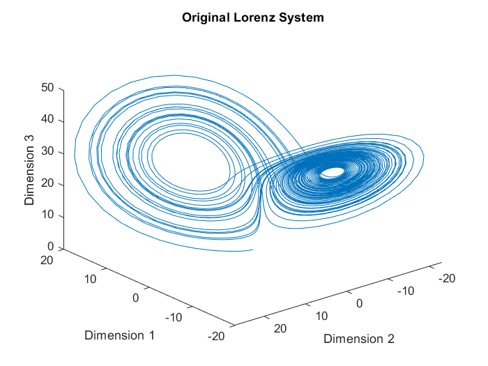
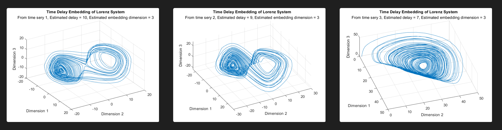
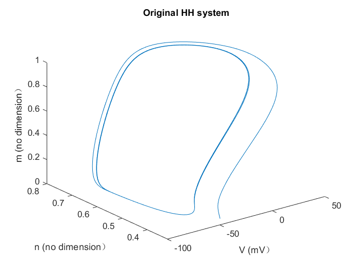
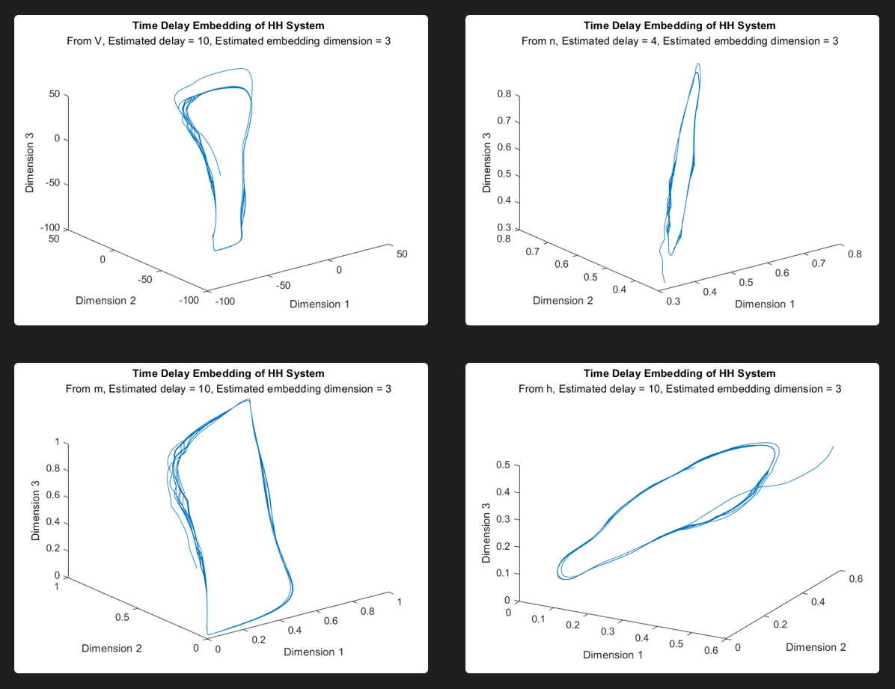

# Tutorial

Just move to some `script.m` and hit `run`.

# Result

Original Lorenz

Reconstructed Lorenz

Original HH

Reconstructed HH

# THINK

The time delay embedding is suitable for deterministic process, not stochastic process.

For example, below are all deterministic process, which this method succeeds in.

* Lorenz
* HH
* perfect circle

For example, below are all stochastic process, which this method fails on.

* $\theta$
* perfect Poisson process
* White Noise Process
